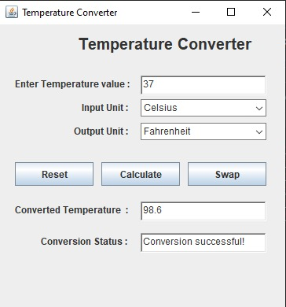

## ☕ Simple Temperature Converter application built using Java AWT,Swing

- It allows users to input a temperature value and select the input/output units to perform conversions between different temperature scales.
- User-friendly input-output interface.

## ⚙️ Features

✅ Every unit to every other unit is possible.

- Celsius
- Fahrenheit
- Kelvin
- Rankine
- Réaumur
- Delisle
- Newton
- Rømer

## 🛠️ Technologies Used

- Java
- AWT
- Swing

## 📥 How to Clone

1. Clone this repository

```bash
git clone https://github.com/Rohan-Korake/Temperature-Converter-Using-Java-AWT-Swing.git
```

2. To Compile

```bash
javac Temperature_Converter.java
```

3. To run

```bash
java Temperature_Converter
```

## 📷 Preview



## 📩 Connect with Me

- 📧 Email : rohannkorake@gmail.com
- 📂 GitHub : https://github.com/Rohan-Korake
- 🔗 Linkedin : https://www.linkedin.com/in/rohan-korake-720848342
